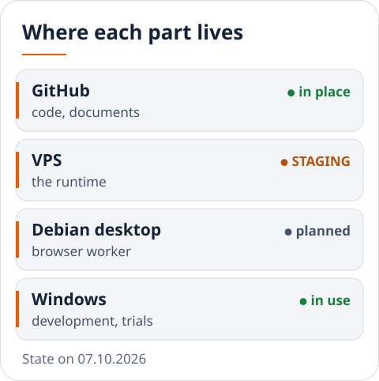
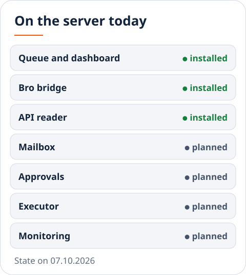
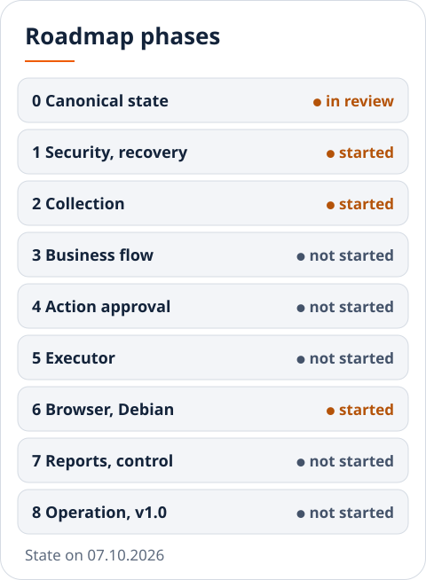
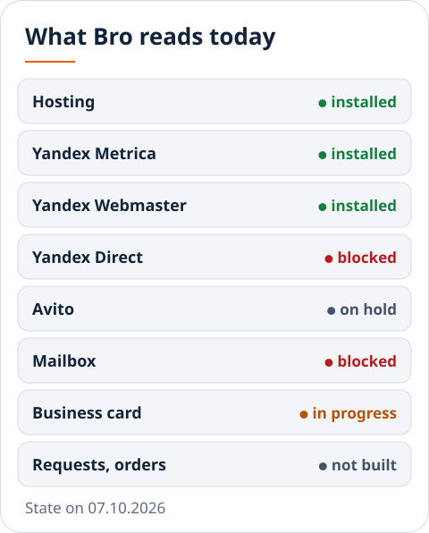
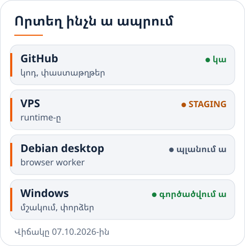
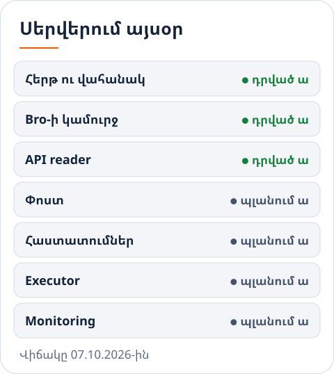
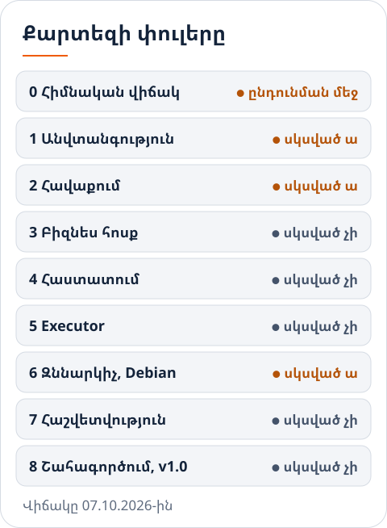
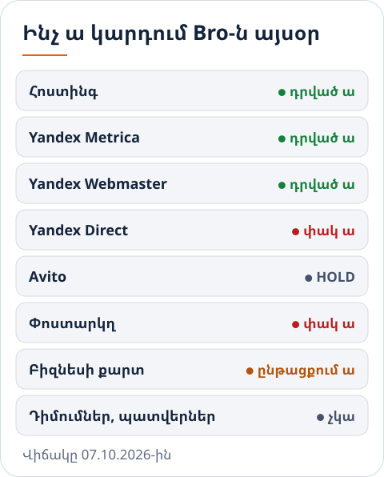

<picture><source media="(max-width: 600px) and (prefers-color-scheme: dark)" srcset="docs/assets/readme/cover-narrow-dark.svg"><source media="(max-width: 600px)" srcset="docs/assets/readme/cover-narrow-light.svg"><source media="(prefers-color-scheme: dark)" srcset="docs/assets/readme/cover-dark.svg"></picture>

# KRYUK24 · Bro

**[Current state](docs/CURRENT_STATE.md)** · **[Roadmap and task queue](docs/ROADMAP.md)** · [Architecture](docs/ARCHITECTURE.md) · [Decisions](docs/DECISIONS.md) · [Operations](docs/OPERATIONS.md) · [Security](docs/SECURITY.md) · [Հայերեն](#հայերեն)

Tow-truck service in Moscow and the Moscow region, public number +7 985 893-06-06. This repository holds the live site, the server-side runtime ("Bro": a daily queue of checks, an operator dashboard, machine readers), the tools that build brand and site material, and the documents that say what is true today.

People: **Armen** owns the business and decides prices, terms, geography and the upper budget limit. **Gev** has the final word on every public and money step. **Claude** builds, operates and verifies. **GPT** reviews, challenges and accepts packages.

First business goal (Gev, 04.10.2026): five profitable completed orders a day on average. Orders, revenue, cost per order and margin are **UNKNOWN** today, not zero: no real request or order is recorded anywhere.

## At a glance

Each picture carries one idea in large labels, so that it reads on a phone. The details are in the table under it and, with evidence, in the linked document. State on 07.10.2026. A status is always a word, never a colour alone.

### Where each part lives

<picture><source media="(prefers-color-scheme: dark)" srcset="docs/assets/readme/placement-en-dark.svg"></picture>

- **GitHub**
  - What lives there: canonical code, documents, decisions, roadmap
  - Today: in place: private repository, checks on every change
- **VPS**
  - What lives there: the runtime: queue and database, API readers, mailbox, approvals, executor of API and mail actions, monitoring
  - Today: STAGING, sending is off; what is installed is in the next picture
- **Debian desktop**
  - What lives there: browser and media worker
  - Today: planned; the move has not started
- **Windows**
  - What lives there: development and supervised trials only
  - Today: in use; the Chrome proxy, the gate and the trial harness are work in progress

Boundaries and data flow: [`docs/ARCHITECTURE.md`](docs/ARCHITECTURE.md).

### On the server today

<picture><source media="(prefers-color-scheme: dark)" srcset="docs/assets/readme/server-en-dark.svg"></picture>

- **Daily queue and dashboard**: installed; ten tasks are planned every day at 06:00 UTC
- **Bro bridge**: installed; the service runs but does not start by itself after a reboot
- **API reader (hosting, Metrica, Webmaster)**: installed on 07.10.2026; its first supervised write is pending
- **Mailbox**: planned; blocked until the mail application exists
- **Approvals**: planned; today only the daily report draft can be approved, not an action
- **Executor**: planned; nothing is written
- **Monitoring**: planned; no schedule is switched on without Gev's separate yes

Evidence for each line: [`docs/CURRENT_STATE.md`](docs/CURRENT_STATE.md).

### Roadmap phases

<picture><source media="(prefers-color-scheme: dark)" srcset="docs/assets/readme/phases-en-dark.svg"></picture>

- **0 Canonical state**
  - Owner / acceptor: Claude / GPT
  - State: in review: done on Claude's side, awaits GPT's acceptance
- **1 Security and recovery**
  - Owner / acceptor: Claude / GPT
  - State: started: off-disk copy exists; credentials clean-up and a rehearsed restore are open
- **2 Reliable collection**
  - Owner / acceptor: Claude / GPT
  - State: started: API reader installed, first supervised write pending
- **3 Real business flow**
  - Owner / acceptor: GPT / Armen
  - State: not started
- **4 Action approval**
  - Owner / acceptor: GPT / Claude
  - State: not started
- **5 Executor**
  - Owner / acceptor: Claude / GPT
  - State: not started
- **6 Browser and Debian**
  - Owner / acceptor: Claude / GPT
  - State: started: the harness failures on the hosted runner are diagnosed and fixed
- **7 Analysis, reporting, control**
  - Owner / acceptor: Claude / Gev
  - State: not started
- **8 Controlled operation and v1.0**
  - Owner / acceptor: Gev / GPT
  - State: not started

A phase closes on its acceptor's word, not on a file. Scope, closing conditions and the task queue: [`docs/ROADMAP.md`](docs/ROADMAP.md).

### What Bro reads today

<picture><source media="(prefers-color-scheme: dark)" srcset="docs/assets/readme/sources-en-dark.svg"></picture>

- **Hosting account**
  - What: balance, days left
  - State: installed
- **Yandex Metrica**
  - What: the site and the Maps card, as two separate readings
  - State: installed
- **Yandex Webmaster**
  - What: indexing of the site
  - State: installed
- **Yandex Direct**
  - What: state and spend
  - State: blocked: waits for Yandex to grant API access
- **Avito**
  - What: listings, statistics
  - State: on hold by Gev; reading works, nothing is changed
- **Mailbox**
  - What: reviews, moderation results, letters from the services
  - State: blocked: no mail application, no credential
- **Yandex Business card**
  - What: card state, reviews
  - State: in progress: no API; the browser route is not accepted yet
- **Real requests and orders**
  - What: request → order → completion → payment
  - State: not built: nothing real is recorded

A source that is not read is UNKNOWN, never "no problem". A click is not a call, a call is not an order, an order is not a paid completion.

## State in ten lines (07.10.2026, details and evidence in [`docs/CURRENT_STATE.md`](docs/CURRENT_STATE.md))

1. The live site equals git tag `v33.1-live` (checked 06.10.2026: 57 of 58 file hashes equal, the 58th is `.htaccess`, which the hosting does not serve).
2. A VPS runs the runtime in **STAGING** at `runtime.kryuk24.ru`; sending is off; every request in its database is a test one.
3. The server plans ten daily tasks at 06:00 UTC (`kryuk-operations.timer`); the backup timer runs separately around 00:00–00:05 UTC.
4. API reader v0.3.2 r2 is **installed** on the staging server (steps 1–10, 07.10.2026 13:00–13:02 UTC, all verified). Step 11, one supervised write run, is **pending** for 08.10.2026 after the 06:00 UTC planning. No timer for it.
5. Beget, Yandex Metrica and Yandex Webmaster are read by API. Yandex Direct API is blocked (access request sent, status "new"). Avito API reads, but Avito is on hold by Gev.
6. The owner approves one thing today: the daily report draft, by its digest. That is not an approval of any action. No executor of actions exists.
7. The mailbox connector does not exist (no app, no credential). Browser reading by an unattended model does not exist (proxy package waits for GPT).
8. Credentials clean-up on Windows is **not closed**: Yandex and Avito secrets are still in the Windows user environment and the local `.mcp.json` hands them to four third-party MCP programs.
9. The project is published in the private repository `menqstudio/Kryuk24` by a clean initial import (07.10.2026); `main` is at the merge of pull request #1 and its CI is green. The earlier history is not in the repository: it is in a verified git bundle, with a copy on an external disk. GitHub does not protect `main` on the current plan (see `docs/SECURITY.md`).
10. Nearest deadlines: Avito listings expire 11.10 and 15.10 (hold, nothing paid); address confirmation for the Yandex card by 13.10; hosting balance lasts until about 15.11.2026 (calculated).

## Where things are

- **`site/`**: The live site exactly as deployed. How to deploy: `site/README.md`
- **`runtime/api_reader/`**: API reader v0.3.2 r2: collector, queue side, installer, tests, evidence
- **`runtime/server/`**: The code exactly as installed on the VPS in `/opt/kryuk24`, fetched read-only on 07.10.2026 13:08 UTC, with `MANIFEST.md`. No database, no credentials
- **`runtime/received/`**: Packages as received from GPT, with `MAPPING.md` (which version is installed, which is superseded)
- **`runtime/wip/chrome_proxy/`**: WIP. Proxy in front of the Chrome tools; never run with a real model
- **`runtime/wip/adapter_preflight/`**: WIP. Gate hook, Windows job runner, tool schemas
- **`runtime/wip/trial/`**: WIP. Supervised trial harness v5.3 and its plan
- **`tools/`**: Site checks (`tools/tests/`), brand and media generators, API setup scripts (`tools/api_setup/`)
- **`research/`**: Owner's prices and answers, Yandex rules, Direct launch package
- **`brand/`, `offers/`, `reports/`, `photo/01_real_polished/`**: Brand sources, texts for the owner, reports, the processed photo set that may be published
- **`docs/`**: The six documents below, `LESSONS.md`, `history/`, `inventory/`, `cleanup/`, `media-index.md`
- **`_drive_staging/`**: Git-ignored. Media and archives that go to Drive, not to GitHub, kept locally until Gev names the Drive. Index: `docs/media-index.md`
- **`_private/`**: Not in git. Private notes (the VPS address is there). Not read by AI sessions

Zip packages for hand-over are placed in `C:\Users\Admin\Desktop\ZIP`, not in the repository.

## How to run the tests

- **Site, local**
  - Command: `tools/.venv/Scripts/python.exe tools/tests/run_checks.py`
  - Last recorded result: expected: issues 0, errors [], links_bad []
- **Site, live (read-only against kryuk24.ru)**
  - Command: same command with `live`
  - Last recorded result: 06.10.2026: issues 0, errors [], links_bad []
- **API reader**
  - Command: in `runtime/api_reader/`: `python -m unittest test_bro_api_reader test_ops_api`
  - Last recorded result: 18 + 27 OK on Windows (Python 3.12.10) and on the server (Python 3.14.4), 07.10.2026
- **Gate and job runner (Windows only)**
  - Command: in `runtime/wip/adapter_preflight/`: `test_bro_gate_hook`, `test_win_job`
  - Last recorded result: 50 + 31 OK, 07.10.2026
- **Chrome proxy (Windows)**
  - Command: in `runtime/wip/chrome_proxy/`: `test_bro_chrome_proxy`
  - Last recorded result: 12 OK, 07.10.2026
- **Trial harness (Windows only)**
  - Command: in `runtime/wip/trial/`: `test_trial_harness`
  - Last recorded result: 68 OK, 07.10.2026

The commands above were run from a fresh clone of the cleanup branch on 07.10.2026, on Windows (Python 3.12.10) and, for the Linux-capable part, on the server in a temporary folder (Python 3.14.4). The runtime code uses the standard library only. `tools/` needs a virtual environment (`tools/.venv`, git-ignored); its packages are listed in `tools/requirements.txt`. CI (`.github/workflows/ci.yml`) runs on GitHub since 07.10.2026. First run on `main` (`8bc7233`): **failed** in the Windows job, because the runner converted line endings on checkout and the fixtures no longer had the expected sha256. Fixed by `.gitattributes` (`* -text`) in pull request #1. On that branch the trial harness self-test then failed on the hosted Windows runner (3 of 68 tests) and was left out of CI for that merge (`0abf9b0`). The cause was found the same day: a race in the trial fixture server, which answered before it wrote its access-log row; fixed in pull request #2 (`d96e4f2`), which put the self-test back and repeats the three affected tests five times. CI on `main` is **green** with everything in: commit identity, Linux (API reader, server code, package manifest, site references), Windows (API reader, gate and job runner, proxy, trial harness self-test). Details: `runtime/wip/README.md`, `docs/cleanup/GITHUB_SETUP_RESULT.md`. `runtime/server/` is tested on Linux: `python3 -m unittest discover -p "test_*.py"` there, 102 pass.

## The other six documents

- **[`docs/ARCHITECTURE.md`](docs/ARCHITECTURE.md)**: What the components are and where the boundaries run: installed today versus target
- **[`docs/CURRENT_STATE.md`](docs/CURRENT_STATE.md)**: What is true today, each item with status and evidence
- **[`docs/DECISIONS.md`](docs/DECISIONS.md)**: What was decided, when and by whom; resolved and open contradictions
- **[`docs/ROADMAP.md`](docs/ROADMAP.md)**: The one prioritised queue with owners, dependencies, next steps and deadlines
- **[`docs/OPERATIONS.md`](docs/OPERATIONS.md)**: Install, backup, recovery, rollback, and whether each was really executed
- **[`docs/SECURITY.md`](docs/SECURITY.md)**: Where secrets live (never a value), authority limits, what an AI session may not hold, known gaps

Also: [`docs/LESSONS.md`](docs/LESSONS.md) (what went wrong and what to do instead; read at session start), `docs/history/` (reports delivered to GPT, manual run records).

## Scope of instructions

- These seven documents are the project's canonical instructions. When they disagree with an older note, a memory entry or a package README, the documents win; for a fact about today, `docs/CURRENT_STATE.md` is the only source.
- The earlier state documents (`00_STATE.md`, `01_TASKS.md`, `HISTORY.md`, `MISSION.md`, `RULES.md`, `BUSINESS_STATE.md`, `GPT_HANDOFF_CURRENT.md`) are merged here and kept only in the private materials and in the git bundle.
- `RULES.md` was an unapproved draft and is not a rule. The one rule in force by practice: every public step and every money step needs Gev's separate yes.
- Status words: IMPLEMENTED (written), VERIFIED (seen working, with evidence), BLOCKED (cannot proceed, with the reason), PLANNED (nothing written). For facts: verified, unverified, UNKNOWN. Nothing unverified is written as fact.
- Each document is bilingual: English first, Armenian after the rule. Text for the owner and for customers is Russian, without the letter "ё".

---

# Հայերեն

**[Գործող վիճակը](docs/CURRENT_STATE.md#հայերեն)** · **[Քարտեզն ու հերթը](docs/ROADMAP.md#հայերեն)** · [Ճարտարապետություն](docs/ARCHITECTURE.md#հայերեն) · [Որոշումներ](docs/DECISIONS.md#հայերեն) · [Աշխատացնել](docs/OPERATIONS.md#հայերեն) · [Անվտանգություն](docs/SECURITY.md#հայերեն) · [English](#kryuk24--bro)

**KRYUK24 (kryuk24.ru)**. էվակուատորի ծառայություն Մոսկվայում ու մարզում, հանրային համարը՝ +7 985 893-06-06։ Էս repo-ում են կենդանի կայքը, սերվերի runtime-ը («Bro». օրվա ստուգումների հերթ, օպերատորի վահանակ, մեքենայական կարդացողներ), բրենդի ու կայքի գործիքները ու էն փաստաթղթերը, որ ասում են՝ ինչն ա այսօր ճիշտ։

Մարդիկ. **Արմենը** բիզնեսի տերն ա, որոշում ա գները, պայմանները, աշխարհագրությունը, բյուջեի վերին սահմանը։ **Գևինն** ա վերջին խոսքը ամեն հրապարակային ու փողային քայլի համար։ **Claude-ը** կառուցում, վարում ու ստուգում ա։ **GPT-ն** review ա անում, առարկում ու ընդունում փաթեթները։

Առաջին նպատակը (Գև, 04.10.2026)՝ միջինը օրը հինգ շահութաբեր ավարտված պատվեր։ Պատվերները, հասույթը, մեկ պատվերի ծախսն ու մարժան այսօր **UNKNOWN** են, ոչ թե զրո. իրական դիմում կամ պատվեր ոչ մի տեղ չի գրվում։

## Մի հայացքով

Ամեն նկար մեկ միտք ա տանում՝ խոշոր գրերով, որ հեռախոսում էլ կարդացվի։ Մանրամասները նկարի տակի աղյուսակում են, իսկ ապացույցով՝ հղված փաստաթղթում։ Վիճակը՝ 07.10.2026-ին։ Կարգավիճակը միշտ բառ ա, երբեք միայն գույն։

### Որտեղ ինչն ա ապրում

<picture><source media="(prefers-color-scheme: dark)" srcset="docs/assets/readme/placement-hy-dark.svg"></picture>

- **GitHub**
  - Ինչ ա ապրում էնտեղ: հիմնական կոդը, փաստաթղթերը, որոշումները, քարտեզը
  - Այսօր: կա. փակ repo, ստուգումներ ամեն փոփոխության վրա
- **VPS**
  - Ինչ ա ապրում էնտեղ: runtime-ը. հերթ ու բազա, API reader-ներ, փոստ, հաստատումներ, API ու փոստի գործողությունների executor, monitoring
  - Այսօր: STAGING, ուղարկելը անջատված ա. ինչն ա դրված՝ հաջորդ նկարում
- **Debian desktop**
  - Ինչ ա ապրում էնտեղ: browser ու media worker
  - Այսօր: պլանում ա. տեղափոխումը չի սկսվել
- **Windows**
  - Ինչ ա ապրում էնտեղ: միայն մշակում ու հսկվող փորձեր
  - Այսօր: գործածվում ա. Chrome proxy-ն, gate-ը ու trial harness-ը ընթացքում են

Սահմաններն ու տվյալների հոսքը՝ [`docs/ARCHITECTURE.md`](docs/ARCHITECTURE.md#հայերեն)։

### Սերվերում այսօր

<picture><source media="(prefers-color-scheme: dark)" srcset="docs/assets/readme/server-hy-dark.svg"></picture>

- **Օրվա հերթ ու վահանակ**: դրված ա. ամեն օր 06:00 UTC-ին պլանավորվում ա տասը գործ
- **Bro-ի կամուրջ**: դրված ա. ծառայությունը աշխատում ա, բայց reboot-ից հետո ինքը չի բարձրանում
- **API reader (հոստինգ, Metrica, Webmaster)**: դրված ա 07.10.2026-ին. առաջին հսկվող գրելը սպասվում ա
- **Փոստ**: պլանում ա. փակ ա, մինչև փոստի հավելվածը լինի
- **Հաստատումներ**: պլանում ա. այսօր հաստատվում ա միայն օրվա հաշվետվության սևագիրը, ոչ թե գործողությունը
- **Executor**: պլանում ա. ոչինչ գրված չի
- **Monitoring**: պլանում ա. առանց Գևի առանձին «հա»-ի ժամանակացույց չի միանում

Ամեն տողի ապացույցը՝ [`docs/CURRENT_STATE.md`](docs/CURRENT_STATE.md#հայերեն)։

### Քարտեզի փուլերը

<picture><source media="(prefers-color-scheme: dark)" srcset="docs/assets/readme/phases-hy-dark.svg"></picture>

- **0 Հիմնական վիճակ**
  - Պատասխանատու / ընդունող: Claude / GPT
  - Վիճակ: ընդունման մեջ. Claude-ի կողմից արված ա, սպասում ա GPT-ի ընդունմանը
- **1 Անվտանգություն ու վերականգնում**
  - Պատասխանատու / ընդունող: Claude / GPT
  - Վիճակ: սկսված ա. արտաքին պատճենը կա. credential-ների մաքրումն ու փորձված restore-ը բաց են
- **2 Հուսալի հավաքում**
  - Պատասխանատու / ընդունող: Claude / GPT
  - Վիճակ: սկսված ա. API reader-ը դրված ա, առաջին հսկվող գրելը սպասվում ա
- **3 Իրական բիզնես հոսք**
  - Պատասխանատու / ընդունող: GPT / Արմեն
  - Վիճակ: սկսված չի
- **4 Գործողության հաստատում**
  - Պատասխանատու / ընդունող: GPT / Claude
  - Վիճակ: սկսված չի
- **5 Executor**
  - Պատասխանատու / ընդունող: Claude / GPT
  - Վիճակ: սկսված չի
- **6 Զննարկիչ ու Debian**
  - Պատասխանատու / ընդունող: Claude / GPT
  - Վիճակ: սկսված ա. hosted runner-ի harness ձախողումները պարզված ու ուղղված են
- **7 Վերլուծություն, հաշվետվություն, հսկողություն**
  - Պատասխանատու / ընդունող: Claude / Գև
  - Վիճակ: սկսված չի
- **8 Հսկվող շահագործում ու v1.0**
  - Պատասխանատու / ընդունող: Գև / GPT
  - Վիճակ: սկսված չի

Փուլը փակում ա ընդունողը, ոչ թե ֆայլը։ Շրջանակը, փակման պայմաններն ու հերթը՝ [`docs/ROADMAP.md`](docs/ROADMAP.md#հայերեն)։

### Ինչ ա կարդում Bro-ն այսօր

<picture><source media="(prefers-color-scheme: dark)" srcset="docs/assets/readme/sources-hy-dark.svg"></picture>

- **Հոստինգի հաշիվ**
  - Ինչ: մնացորդ, մնացած օրեր
  - Վիճակ: դրված ա
- **Yandex Metrica**
  - Ինչ: կայքն ու Քարտեզի քարտը՝ երկու առանձին ընթերցում
  - Վիճակ: դրված ա
- **Yandex Webmaster**
  - Ինչ: կայքի ինդեքսավորում
  - Վիճակ: դրված ա
- **Yandex Direct**
  - Ինչ: վիճակ ու ծախս
  - Վիճակ: փակ ա. սպասում ա Yandex-ի API թույլտվությանը
- **Avito**
  - Ինչ: հայտարարություններ, վիճակագրություն
  - Վիճակ: HOLD՝ Գևի խոսքով. կարդալը աշխատում ա, ոչինչ չի փոխվում
- **Փոստարկղ**
  - Ինչ: կարծիքներ, մոդերացիայի արդյունքներ, ծառայությունների նամակներ
  - Վիճակ: փակ ա. փոստի հավելված ու բանալի չկա
- **Yandex Բիզնեսի քարտ**
  - Ինչ: քարտի վիճակ, կարծիքներ
  - Վիճակ: ընթացքում ա. API չկա, զննարկչի ճանապարհը դեռ ընդունված չի
- **Իրական դիմումներ ու պատվերներ**
  - Ինչ: դիմում → պատվեր → ավարտ → վճարում
  - Վիճակ: չկա. իրական ոչինչ չի գրանցվում

Չկարդացված աղբյուրը UNKNOWN ա, ոչ թե «խնդիր չկա»։ Սեղմումը զանգ չի, զանգը պատվեր չի, պատվերը վճարված ավարտ չի։

## Վիճակը տասը տողով (07.10.2026, մանրամասնն ու ապացույցը՝ [`docs/CURRENT_STATE.md`](docs/CURRENT_STATE.md))

1. Կենդանի կայքը նույնն ա, ինչ git-ի `v33.1-live` պիտակը (ստուգված 06.10.2026. 58 ֆայլից 57-ի hash-ը համընկնում ա, 58-րդը `.htaccess`-ն ա, որ հոստինգը դրսից չի տալիս)։
2. VPS-ում runtime-ը աշխատում ա **STAGING** ռեժիմով՝ `runtime.kryuk24.ru`. ուղարկելը անջատված ա. բազայի բոլոր հայտերը թեստային են։
3. Սերվերը ամեն օր 06:00 UTC-ին պլանավորում ա տասը գործ (`kryuk-operations.timer`). պահուստի timer-ը առանձին ա, մոտ 00:00–00:05 UTC։
4. API reader v0.3.2 r2-ը **դրված ա** staging սերվերում (1–10 քայլերը, 07.10.2026 13:00–13:02 UTC, բոլորը ստուգված)։ 11-րդ քայլը՝ մեկ հսկվող գրող գործարկում, **սպասում ա** 08.10.2026-ին, 06:00 UTC-ի պլանավորումից հետո։ Timer չկա։
5. Beget-ը, Yandex Metrica-ն ու Webmaster-ը կարդացվում են API-ով։ Yandex Direct-ի API-ն փակ ա (հայտը ուղարկված ա, վիճակը «новая»)։ Avito-ի API-ն կարդում ա, բայց Avito-ն Գևի HOLD-ի տակ ա։
6. Այսօր տերը հաստատում ա մի բան՝ օրվա հաշվետվության սևագիրը, digest-ով։ Դա ոչ մի գործողության թույլտվություն չի։ Գործողությունների executor չկա։
7. Փոստի connector չկա (ոչ հավելված, ոչ credential)։ Առանց հսկողության մոդելով զննարկիչ կարդալը չկա (proxy-ի փաթեթը սպասում ա GPT-ին)։
8. Windows-ում credential-ների մաքրումը **փակված չի**. Yandex-ի ու Avito-ի գաղտնիքները դեռ Windows-ի user environment-ում են, ու տեղային `.mcp.json`-ը դրանք տալիս ա չորս կողմնակի MCP ծրագրի։
9. Նախագիծը հրապարակված ա `menqstudio/Kryuk24` փակ repo-ում՝ մաքուր սկզբնական import-ով (07.10.2026). `main`-ը pull request #1-ի merge-ի վրա ա, CI-ն կանաչ ա։ Հին պատմությունը repo-ում չկա. ստուգված git bundle-ում ա, պատճենը՝ արտաքին սկավառակի վրա։ GitHub-ը այս plan-ով `main`-ը չի պաշտպանում (տես `docs/SECURITY.md`)։
10. Մոտակա ժամկետները. Avito-ի հայտարարությունները փակվում են 11.10-ին ու 15.10-ին (HOLD, ոչինչ չի վճարվել). Yandex-ի քարտի հասցեի հաստատումը՝ մինչև 13.10. հոստինգի մնացորդը հերիքում ա մոտ մինչև 15.11.2026 (հաշվարկ)։

## Որտեղ ինչն ա

- **`site/`**: Կենդանի կայքը, ոնց որ դրված ա։ Հրապարակելու կարգը՝ `site/README.md`
- **`runtime/api_reader/`**: API reader v0.3.2 r2. collector, հերթի կողմը, installer, թեստեր, ապացույցներ
- **`runtime/server/`**: Կոդը ճիշտ էնպես, ոնց դրված ա VPS-ում `/opt/kryuk24`-ում, վերցված միայն կարդալով 07.10.2026 13:08 UTC-ին, `MANIFEST.md`-ով։ Ոչ բազա կա, ոչ credential
- **`runtime/received/`**: GPT-ից ստացված փաթեթները, ոնց եկել են, `MAPPING.md`-ով (որ տարբերակն ա դրված, որը՝ փոխարինված)
- **`runtime/wip/chrome_proxy/`**: WIP. Chrome-ի գործիքների առաջ դրված proxy. իսկական մոդելով չի աշխատել
- **`runtime/wip/adapter_preflight/`**: WIP. gate hook, Windows-ի job runner, գործիքների սխեմաներ
- **`runtime/wip/trial/`**: WIP. հսկվող փորձի harness v5.3-ն ու պլանը
- **`tools/`**: Կայքի ստուգումները (`tools/tests/`), բրենդի ու մեդիայի գեներատորները, API-ի setup սկրիպտները (`tools/api_setup/`)
- **`research/`**: Տիրոջ գներն ու պատասխանները, Yandex-ի կանոնները, Direct-ի գործարկման փաթեթը
- **`brand/`, `offers/`, `reports/`, `photo/01_real_polished/`**: Բրենդի աղբյուրները, տեքստեր տիրոջ համար, հաշվետվություններ, մշակված նկարների սեթը, որ կարելի ա հրապարակել
- **`docs/`**: Ներքևի վեց փաստաթուղթը, `LESSONS.md`, `history/`, `inventory/`, `cleanup/`, `media-index.md`
- **`_drive_staging/`**: Git-ում չի։ Մեդիան ու արխիվները, որ գնում են Drive, ոչ GitHub. տեղում են, մինչև Գևը ասի՝ որ Drive-ը։ Ցուցակը՝ `docs/media-index.md`
- **`_private/`**: Git-ում չի։ Անձնական նշումներ (VPS-ի հասցեն էնտեղ ա)։ AI նիստերը չեն կարդում

Փոխանցման zip-երը դրվում են `C:\Users\Admin\Desktop\ZIP`-ում, ոչ repo-ում։

## Թեստերը ոնց աշխատացնել

- **Կայք, տեղում**
  - Հրաման: `tools/.venv/Scripts/python.exe tools/tests/run_checks.py`
  - Վերջին գրանցված արդյունք: սպասվում ա՝ issues 0, errors [], links_bad []
- **Կայք, կենդանի (միայն կարդում ա kryuk24.ru-ն)**
  - Հրաման: նույն հրամանը՝ `live`-ով
  - Վերջին գրանցված արդյունք: 06.10.2026՝ issues 0, errors [], links_bad []
- **API reader**
  - Հրաման: `runtime/api_reader/`-ում՝ `python -m unittest test_bro_api_reader test_ops_api`
  - Վերջին գրանցված արդյունք: 18 + 27 OK Windows-ում (Python 3.12.10) ու սերվերում (Python 3.14.4), 07.10.2026
- **Gate ու job runner (միայն Windows)**
  - Հրաման: `runtime/wip/adapter_preflight/`-ում՝ `test_bro_gate_hook`, `test_win_job`
  - Վերջին գրանցված արդյունք: 50 + 31 OK, 07.10.2026
- **Chrome proxy (Windows)**
  - Հրաման: `runtime/wip/chrome_proxy/`-ում՝ `test_bro_chrome_proxy`
  - Վերջին գրանցված արդյունք: 12 OK, 07.10.2026
- **Trial harness (միայն Windows)**
  - Հրաման: `runtime/wip/trial/`-ում՝ `test_trial_harness`
  - Վերջին գրանցված արդյունք: 68 OK, 07.10.2026

Վերևի հրամանները աշխատացվել են մաքրման ճյուղի թարմ clone-ից 07.10.2026-ին՝ Windows-ում (Python 3.12.10) ու, Linux-ին հարմար մասը, սերվերի ժամանակավոր թղթապանակում (Python 3.14.4)։ Runtime-ի կոդը միայն ստանդարտ գրադարանով ա։ `tools/`-ին պետք ա virtual environment (`tools/.venv`, git-ում չի). փաթեթների ցուցակը՝ `tools/requirements.txt`։ CI-ն (`.github/workflows/ci.yml`) GitHub-ում աշխատում ա 07.10.2026-ից։ Առաջին գործարկումը `main`-ի վրա (`8bc7233`)՝ **ձախողվեց** Windows job-ում. runner-ը checkout-ի ժամանակ փոխում էր տողերի վերջավորությունները, ու fixture-ների sha256-ը էլ չէր համընկնում։ Ուղղվել ա `.gitattributes`-ով (`* -text`), pull request #1։ Էդ ճյուղում հետո ընկավ trial harness-ի self-test-ը hosted Windows runner-ում (68-ից 3-ը), ու էդ merge-ի համար (`0abf9b0`) դուրս մնաց CI-ից։ Պատճառը գտնվեց նույն օրը. մրցավազք trial-ի թեստային սերվերում, որը պատասխանում էր, մինչև իր մատյանի տողը գրելը. ուղղված ա pull request #2-ում (`d96e4f2`), որը self-test-ը վերադարձրել ա ու երեք թեստը կրկնում ա հինգ անգամ։ `main`-ի CI-ն **կանաչ ա** ամեն ինչով. commit-ների identity, Linux (API reader, սերվերի կոդ, փաթեթի manifest, կայքի հղումներ), Windows (API reader, gate ու job runner, proxy, trial harness self-test)։ Մանրամասնը՝ `runtime/wip/README.md`, `docs/cleanup/GITHUB_SETUP_RESULT.md`։ `runtime/server/`-ը ստուգվում ա Linux-ում. `python3 -m unittest discover -p "test_*.py"`, 102-ն անցնում ա։

## Մնացած վեց փաստաթուղթը

- **[`docs/ARCHITECTURE.md`](docs/ARCHITECTURE.md)**: Ինչ բաղադրիչներ կան ու որտեղով են անցնում սահմանները. այսօր դրվածը ու թիրախը՝ առանձին
- **[`docs/CURRENT_STATE.md`](docs/CURRENT_STATE.md)**: Ինչն ա այսօր ճիշտ, ամեն կետը՝ վիճակով ու ապացույցով
- **[`docs/DECISIONS.md`](docs/DECISIONS.md)**: Ինչ ա որոշվել, երբ ու ով. լուծված ու բաց հակասությունները
- **[`docs/ROADMAP.md`](docs/ROADMAP.md)**: Մեկ առաջնահերթ հերթ՝ տերերով, կախվածություններով, հաջորդ քայլով ու ժամկետներով
- **[`docs/OPERATIONS.md`](docs/OPERATIONS.md)**: Դնել, պահուստ, վերականգնում, հետ գնալ, ու ամեն մեկը իրոք արվե՞լ ա
- **[`docs/SECURITY.md`](docs/SECURITY.md)**: Որտեղ են գաղտնիքները (երբեք արժեք), լիազորությունների սահմանները, ինչ չպիտի ունենա AI նիստը, հայտնի բացերը

Նաև՝ [`docs/LESSONS.md`](docs/LESSONS.md) (ինչն ա սխալ գնացել ու ոնց անել հաջորդ անգամ. կարդացվում ա նիստի սկզբում), `docs/history/` (GPT-ին տրված զեկույցները, ձեռքով շրջայցերի գրառումները)։

## Հրահանգների շրջանակը

- Էս յոթ փաստաթուղթը նախագծի կանոնական հրահանգներն են։ Երբ հին նշումի, հիշողության գրառման կամ փաթեթի README-ի հետ չեն համընկնում, հաղթում են սրանք. այսօրվա փաստի համար միակ աղբյուրը `docs/CURRENT_STATE.md`-ն ա։
- Հին վիճակի փաստաթղթերը (`00_STATE.md`, `01_TASKS.md`, `HISTORY.md`, `MISSION.md`, `RULES.md`, `BUSINESS_STATE.md`, `GPT_HANDOFF_CURRENT.md`) միացված են էստեղ ու մնում են միայն անձնական նյութերում ու git bundle-ում։
- `RULES.md`-ն չհաստատված սևագիր էր, կանոն չի։ Փաստացի գործող կանոնը մեկն ա. ամեն հրապարակային ու ամեն փողային քայլ՝ Գևի առանձին «հա»-ով։
- Վիճակի բառերը. IMPLEMENTED (գրված ա), VERIFIED (տեսել ենք աշխատելիս, ապացույցով), BLOCKED (առաջ չի գնում, պատճառով), PLANNED (ոչինչ գրված չի)։ Փաստերի համար՝ ստուգված, չստուգված, UNKNOWN։ Չստուգածը որպես փաստ չի գրվում։
- Ամեն փաստաթուղթ երկլեզու ա. նախ անգլերեն, գծից հետո՝ հայերեն։ Տիրոջ ու հաճախորդների համար տեքստը ռուսերեն ա, առանց «ё»-ի։
